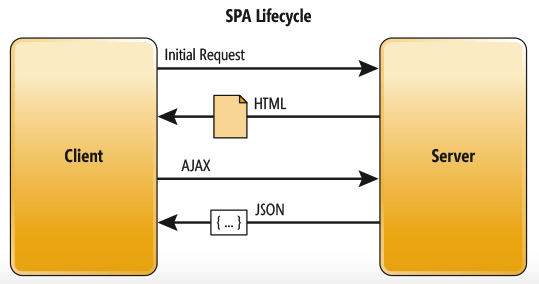

# SPA Lifecycle

In an SPA, after the first page loads, all interaction with the server happens through AJAX calls. These AJAX calls return data — not markup — usually in JSON format. The app uses the JSON data to update the page dynamically, without reloading the page. Figure below illustrates SPA behavior.

One benefit of SPAs is obvious: Applications are more fluid and responsive, without the jarring effect of reloading and re-rendering the page. Another benefit might be less obvious and it concerns how you architect a Web app. Sending the app data as JSON creates a separation between the presentation (HTML markup) and application logic (AJAX requests plus JSON responses).

This separation makes it easier to design and evolve each layer. In a well-architected SPA, you can change the HTML markup without touching the code that implements the application logic (at least, that’s the ideal).

In a pure SPA, all UI interaction occurs on the client side, through JavaScript and CSS. After the initial page load, the server acts purely as a service layer. The client just needs to know what HTTP requests to send. It doesn’t care how the server implements things on the back end.

With this architecture, the client and the service are independent. You could replace the entire back end that runs the service, and as long as you don’t change the API, you won’t break the client. The reverse is also true—you can replace the entire client app without changing the service layer. For example, you might write a native mobile client that consumes the service.

### References:
- [1. Microsoft Docs](https://docs.microsoft.com/en-us/archive/msdn-magazine/2013/november/asp-net-single-page-applications-build-modern-responsive-web-apps-with-asp-net)