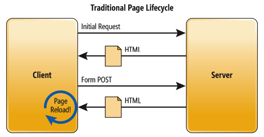

In a traditional Web app, every time the app calls the server, the server renders a new HTML page. This triggers a page refresh in the browser. Figure below illustrates the Traditional Page Lifecycle.

### References:
- [1. Microsoft Docs](https://docs.microsoft.com/en-us/archive/msdn-magazine/2013/november/asp-net-single-page-applications-build-modern-responsive-web-apps-with-asp-net)